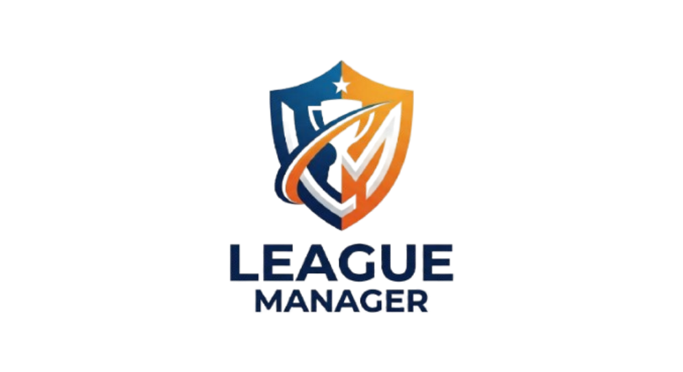

# 🏆 LeagueManager

  
  
  

---

## 🎨 El Logo del Proyecto

  
   
  <strong>⚽ Gestión Integral de Competiciones Deportivas 🏀</strong>

---

## 📝 Descripción

**League Manager** es una aplicación diseñada para la administración, control y seguimiento de ligas o torneos deportivos.

Utilizando una arquitectura limpia basada en los patrones **MVC (Modelo-Vista-Controlador)** y **DAO (Data Access Object)**, la aplicación garantiza una sincronización perfecta y en tiempo real entre la interfaz gráfica de usuario y la persistencia del sistema.

---

## 🚀 Funcionalidades Clave

La aplicación cubre todo el flujo de negocio de una competición deportiva a través de módulos completamente interconectados:

* **🛡️ Gestión de Competiciones:** Creación de ligas personalizadas definiendo el nombre, la temporada (ej. 25/26) y el límite máximo de participantes admitidos.
* **⚽ Gestión de Equipos:** Registro, edición y desvinculación de clubes. Incluye un sistema de seguridad que bloquea la inscripción si la liga ha alcanzado su cupo máximo.
* **🏃 Plantillas Vivas:** CRUD completo para la gestión del cuerpo técnico (entrenadores) y futbolistas. Cuenta con validaciones estrictas de **DNIs únicos** y control de dorsales por equipo.
* **📅 Calendarios y Jornadas Inteligentes:** Motor de emparejamientos diseñado para asegurar el correcto flujo de partidos, impidiendo de forma matemática que las jornadas o los rivales se dupliquen de forma inválida.
* **📊 Clasificación Automática:** Panel de control interactivo que calcula en tiempo real los puntos ($+3$ por victoria, $+1$ por empate), goles a favor, goles en contra y el gol average ($\text{DG}$) general.

---

## 🛠️ Stack Tecnológico

* **Lenguaje:** Java 17 o superior.
* **Interfaz Gráfica:** JavaFX (vistas diseñadas y ajustadas mediante Scene Builder).
* **Base de Datos:** MySQL Workbench (Persistencia relacional gestionada mediante JDBC).
* **Gestor de Dependencias:** Maven.

---

## 👤 Autor

* **Daniel Valverde Fernández** — *Desarrollador Principal* 🚀

---

  Desarrollado en JavaFX - 2026

